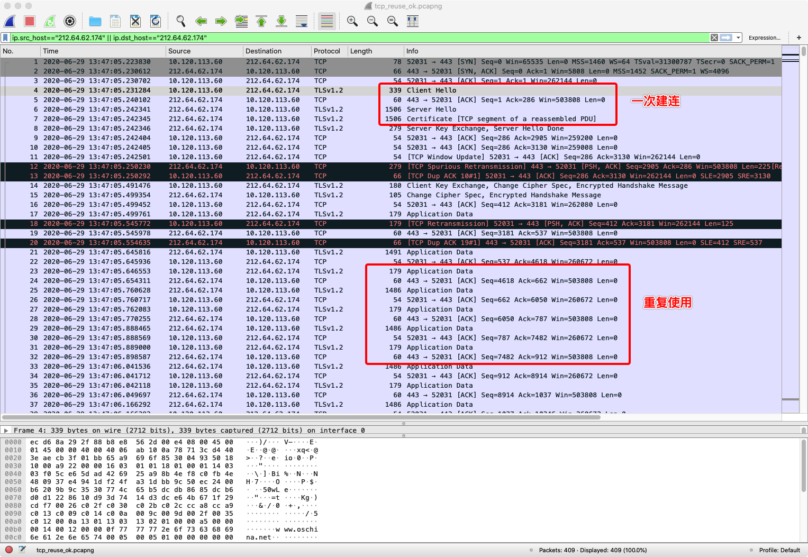
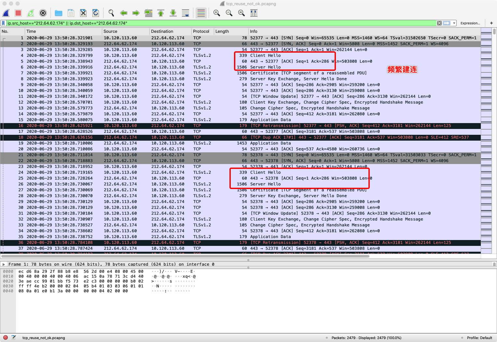

# Go HTTP 重用底层TCP连接需要注意的关键点

## 前沿

在写这篇文章之前，我在社区搜索了一下，找到了一个相关的帖子 [can't assign requested address 错误解决](https://gocn.vip/topics/8470)，还是 @astaxie 自己写的。当然这里我之所以重复再写一个新帖子，是希望给大家提供一种新的验证的方式。

## 问题

有一次我在看某个项目（可能是kafka吧，记不清楚了）的源码的时候，我发现它的注释里面特别提到一句话，说是要读取完 `http.Response` 的 `Body`并关闭它，否则不会重用底层的 TCP 连接。我想了想为什么它这里一定要特别提出来呢？关闭 `http.Response` 不是一个常识性动作么？比如一般写代码我们都会遵循下面的模式：

```go
resp, err := http.Get("http://www.example.com")
if err != nil {
    return err
}
defer resp.Body.Close()

respBody, err := ioutil.ReadAll(resp.Body)
// ...
```

在结合实际的场景之后，我发现其实有的时候问题出在`我们并不总是`会去读取完整个`http.Response` 的 `Body`。为什么这么说呢？

在常见的 API 开发的业务逻辑中，我们会定义一个 JSON 的对象来反序列化 `http.Response` 的 `Body`，但是通常在反序列化这个回复之前，我们会做一些 http 的 `StatusCode` 检查，比如当 `StatusCode` 为 `200` 的时候，我们才去读取 `http.Response` 的 `Body`，如果不是 `200`，我们就直接返回一个包装好的错误。比如下面的模式：

```go
resp, err := http.Get("http://www.example.com")
if err != nil {
    return err
}
defer resp.Body.Close()

if resp.StatusCode == http.StatusOK {
    var apiRet APIRet
    decoder := json.NewDecoder(resp.Body)
    err := decoder.Decode(&apiRet)
    // ...
}
```

如果代码是按照上面的这种方式写的话，那么在请求异常的时候，会导致大量的底层 TCP 无法重用，所以我们稍微改进下就可以了。

```go
resp, err := http.Get("http://www.example.com")
if err != nil {
    return err
}
defer resp.Body.Close()

if resp.StatusCode == http.StatusOK {
    var apiRet APIRet
    decoder := json.NewDecoder(resp.Body)
    err := decoder.Decode(&apiRet)
    // ...
}else{
    io.Copy(ioutil.Discard, resp.Body)
    // ...
}
```

我们通过直接将 `http.Response`  的 `Body` 丢弃掉就可以了。

## 原因

在 Go 的源码中，关于这个问题有特别的注释。

```go
// Body represents the response body.
//
// The response body is streamed on demand as the Body field
// is read. If the network connection fails or the server
// terminates the response, Body.Read calls return an error.
//
// The http Client and Transport guarantee that Body is always
// non-nil, even on responses without a body or responses with
// a zero-length body. It is the caller's responsibility to
// close Body. The default HTTP client's Transport may not
// reuse HTTP/1.x "keep-alive" TCP connections if the Body is
// not read to completion and closed.
//
// The Body is automatically dechunked if the server replied
// with a "chunked" Transfer-Encoding.
//
// As of Go 1.12, the Body will also implement io.Writer
// on a successful "101 Switching Protocols" response,
// as used by WebSockets and HTTP/2's "h2c" mode.
Body io.ReadCloser
```

其中提到了必须将 `http.Response` 的 `Body` 读取完毕并且关闭后，才会重试底层的 TCP 连接。

## 实验 

为了验证一把上面的问题，我们写了一个简单的对比实验，并且通过 Wireshark 抓包分析了一下。这里使用的是 https://www.oschina.net 作为例子，由于这个站点用的是 HTTPS，所以重用了 TCP 的话，那么一次建立 TLS 连接后面就不用重建了，非常方便观察。

### 重用了TCP连接

```go
package main

import (
	"net/http"
)

func main() {
	count := 100
	for i := 0; i < count; i++ {
		resp, err := http.Get("https://www.oschina.net")
		if err != nil {
			panic(err)
		}
		defer resp.Body.Close()
		io.Copy(ioutil.Discard, resp.Body)
	}
}
```



### 未重用TCP连接

```go
package main

import (
	"net/http"
)

func main() {
	count := 100
	for i := 0; i < count; i++ {
		resp, err := http.Get("https://www.oschina.net")
		if err != nil {
			panic(err)
		}
		defer resp.Body.Close()
		//io.Copy(ioutil.Discard, resp.Body)
	}
}
```



## 小结

学无止境，小心翼翼。